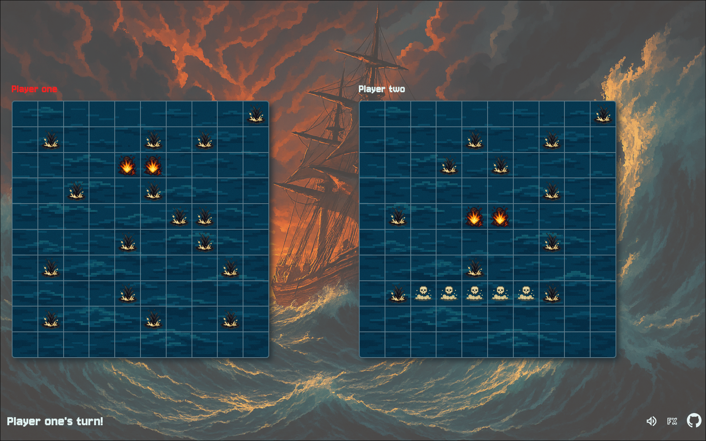

# Battleship Game 🚢

A web-based implementation of the classic Battleship board game. This project is part of the [The Odin Project](https://www.theodinproject.com/) full-stack curriculum.

---

Visit the live version [here](https://fran-dv.github.io/battleship-game/)



---

## About the project
The web version of the classic Battleship game, featuring a clean, modern UI. This project is an assignment in the JavaScript section of The Odin Project curriculum. Its primary goal was to practice TDD (Test-Driven Development). I made it with my own approach, using a modern technology stack, and I wrote all tests using [Vitest](https://vitest.dev/). See the original project assignment [here](https://www.theodinproject.com/lessons/node-path-javascript-battleship)

---

## UI & Gameplay

- Both player boards render in the browser; clicking a cell on the enemy board triggers an attack.
- After each move, the targeted cell updates to show a hit or miss.
- The game ends when all ships on one side are sunk, with an option to play again.

---

## Features

- Fully responsive and intuitive user interface 
- Immersive experience with ambient music and sound effects
- Intuitive drag-and-drop ship placement (including touch support on mobile)
- Single-player mode versus the computer or local multiplayer
- Computer opponent makes random, valid attacks and targets adjacent cells after a hit

---

## Technologies and tools

- **TypeScript** — strong typing and modern JavaScript features
- **CSS Modules** — scoped, maintainable styles
- **Vite** — fast builds and development server
- **Vitest** — ESM-compatible testing with TDD
- **Bun** — package manager and task runner
- **ESLint & Prettier** — linting and code formatting

---

## Project Structure

```bash
src/
├── assets/        # Game assets (images, audio)
├── core/          # Game logic and core functionality
├── ui/            # User interface logic
├── test/          # Test files
├── utilities/     # Utility functions
├── index.css      # Global styles
└── main.ts        # Entry point
```

---

## License

This project is licensed under the MIT License - see the [LICENSE](LICENSE) file for details.